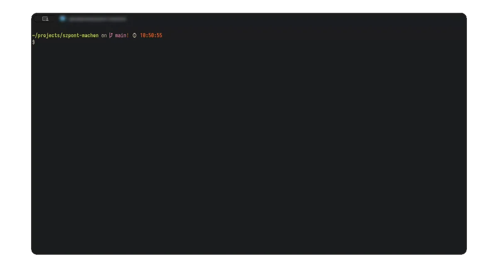
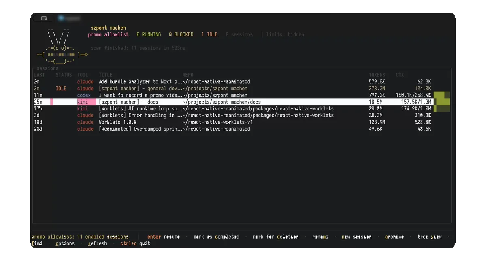
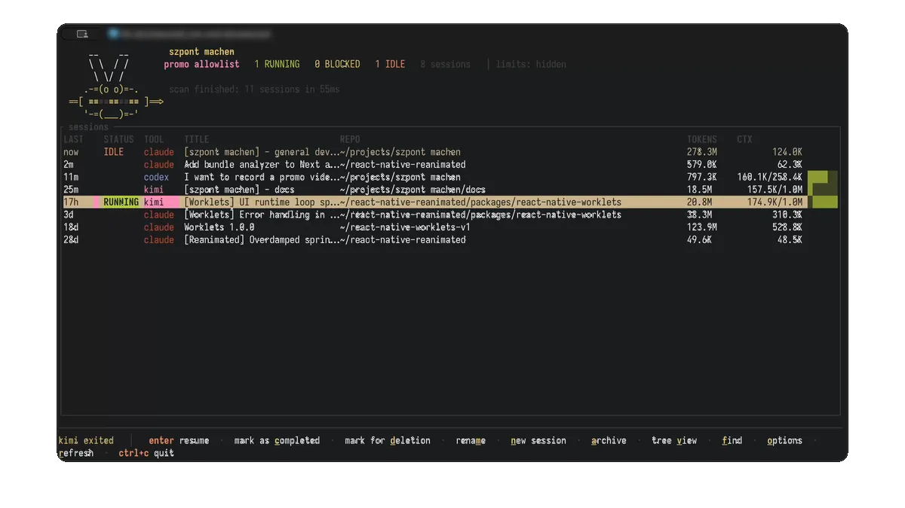
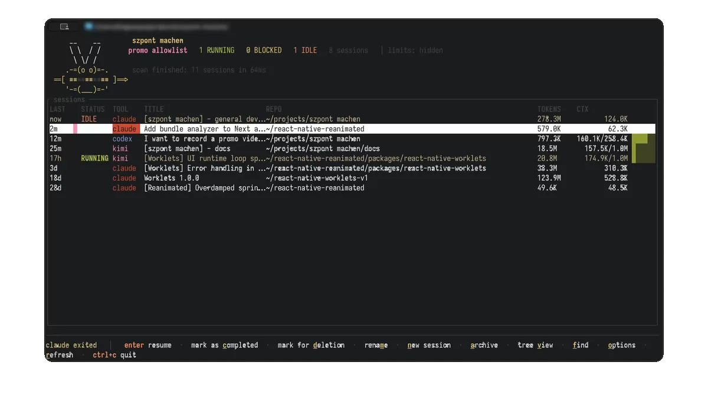
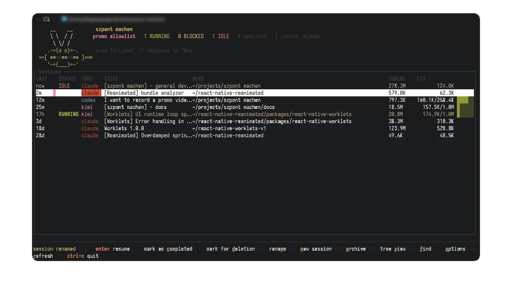

# szpont machen

```
      __    __
      \ \  / /
       \ \/ /
     .-=(o o)=-.
  ==[ ≡≡≡≡≡≡≡≡≡≡≡ ]==>
     '-=(___)=-'
```

A terminal manager for AI CLI tool sessions — **Claude Code**, **Codex CLI** and **Kimi Code**. It tracks sessions on your machine, shows token usage and rate-limit state, resumes any session with the right tool, and archives sessions you are done with.

Docs: <https://tjzel.dev/szpont-machen/>

## Features

### Intuitive TUI experience



### Resume your sessions



### Start new sessions


### Archive your work



### Rename your session



### View as a tree



## Install

macOS and Linux (arm64 and x86_64).

### Homebrew

```sh
brew install tjzel/tap/szpont
```

### Shell installer

```sh
curl -LsSf https://github.com/tjzel/szpont-machen/releases/latest/download/szpont-installer.sh | sh
```

Prebuilt binaries. Ships with a `szpont-update` companion for self-updates.

### crates.io

Requires Rust 1.91+ and a C compiler (SQLite is built from source).

```sh
cargo install szpont
```

### From source

```sh
git clone https://github.com/tjzel/szpont-machen.git && cd szpont-machen
cargo install --path szpont
```

Cargo installs `szpont` into `~/.cargo/bin` — make sure it is on your `PATH`.

Exact limit data from the providers' usage endpoints is included out of the box.

## Usage

```sh
szpont
```

In a repo it shows that repo's sessions; elsewhere it shows all sessions. Key hints are at the bottom of the screen. Everything else is in the [docs](https://tjzel.dev/szpont-machen/).

## Development

`cargo fmt` (4-space indentation, `rustfmt.toml`) and `cargo lint` (clippy with `pedantic` denied, see `szpont/Cargo.toml` `[lints]`).

Licensed under The Unlicense (public domain).
